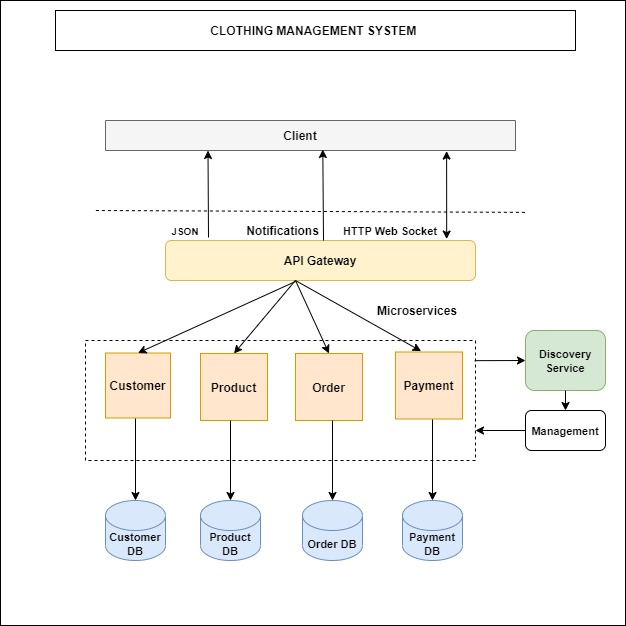

# Clothing Management System [Microservice]
> Project represents Clothing Management System for a shop.

## Introduction

This application process following functionalities.
>        login form    
>        customer details
>        product details
>        order details
>        payment details

## Service Diagram 

## Technologies
> JAVA  |
> Microservice |
> Docker |
> Angular [Frontend]
> 
## License

This project is licensed under the MIT License - see the [LICENSE.txt](LICENSE.txt) file for details.

## Author

name  : Poornima Vithanage

e-mail : vithanagepurnima@gmail.com

[Github] (https://github.com/poornimavithanage)
